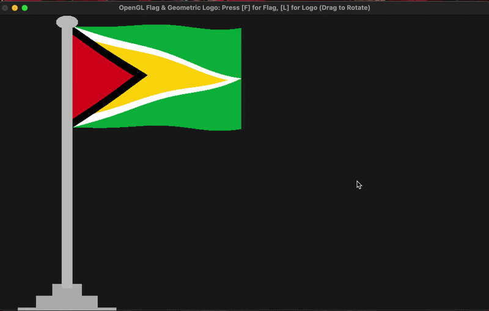

# OpenGL-Flag-Logo-Renderer
This project is a Computer Graphics implementation using **OpenGL** and **C++**. The goal is to render the national flag of Guyana and a geometric logo using basic primitives and mathematical transformations.

## Project Overview
- **Assignment:** Project 1 - Flag & Logo Rendering 
- **Assigned Task:** #8 (Guyana Flag & Geometric Logo)
- **Framework:** OpenGL (GLUT)
- **Language:** C++

## Live Preview


## Features to Implement
- **Basic Primitives:** Drawing using Points, Lines, and Polygons.
- **Color Accuracy:** Implementation of real-world RGB values for the Guyana Flag.
- **Transformations:** 
    - Translation (Positioning)
    - Rotation (Symmetry in Logo)
    - Scaling (Size adjustment)

## 📂 Project Structure
- `src/`: Main source code files.
- `assets/`: Reference images and resources.
- `docs/`: Technical documentation and design plan.

## Prerequisites & Environment Setup

Follow these steps to set up the graphics environment on your computer.

### For Windows Users (Step-by-Step Installation)

Windows does not come with C++ and OpenGL tools pre-installed. We will use the built-in **Windows Package Manager (winget)** to set everything up.

#### **Step 1: Check for Winget**
1. Press the **Windows Key**, type `cmd`, and press Enter to open the Command Prompt.
2. Type the following and press Enter:

```cmd
winget --version
```

1. If you see a version number: Great! Proceed to Step 2.

2. If you see "command not found": You need to install Winget. Go to the Official Microsoft Store Link and install the "App Installer".

### Step 2: Install the C++ Toolkit (MSYS2)
- In the same Command Prompt window, copy and paste this command:
 ```cmd
  winget install MSYS2.MSYS2
 ```
  Wait for the installation to finish.

#### Step 3: Install OpenGL and Build Tools
1. Open your Start Menu, search for "MSYS2 UCRT64", and open it (a black terminal will appear).

2. Type the following command to install the compiler, OpenGL, and the Make utility:
   ```bash
   pacman -S mingw-w64-ucrt-x86_64-gcc mingw-w64-ucrt-x86_64-freeglut mingw-w64-ucrt-x86_64-make
   ```
   Press Enter to confirm the installation.

3.Type Y and press Enter when prompted to confirm the installation.

#### Step 4: Set Environment Path (Crucial)
To allow Windows to recognize the tools:

1. Search for "Edit the system environment variables" in the Windows taskbar and open it.

2. Click the Environment Variables button.

3. Under System variables, find Path, select it, and click Edit.

4. Click New and paste this exact path: C:\msys64\ucrt64\bin

5. Click OK on all windows and Restart your Command Prompt.

#### For macOS Users
1. Install Tools: Open Terminal and run:
 ```bash
    xcode-select --install
    brew install freeglut
  ```

### Step 5: How to Setup and Run

1. Clone the Project
Open your Terminal (Mac) or Command Prompt (Windows) and run:
#### Navigate to your desktop
```bash
cd Desktop
```

#### Download the project
```bash
git clone https://github.com/nigusmamo/OpenGL-Flag-Logo-Renderer.git
```
#### Enter the project folder
```bash
cd OpenGL-Flag-Logo-Renderer
```
### 2. Build and Run
Type the following one-line command:

On macOS:
```bash
 make
```
On Windows:
```bash
 mingw32-make
```

### Interaction Controls
- Mouse Drag: Click and move the mouse to rotate the 3D flag and logo.

- Key [F]: Display the Guyana National Flag with wave animation.

- Key [L]: Display the 3D Tapered Geometric Logo.

## Contributors
- **[Temesgen Geta----------------01340/16]**
- **[Alemayehu Moges--------------02142/16]**
- **[Muluken Melkie---------------01933/16]**
- **[Ermiyas Lakew----------------01774/16]**
- **[Desalegn Birhane-------------01049/16]**
- **[Mulisa Gadisa----------------01691/16]**